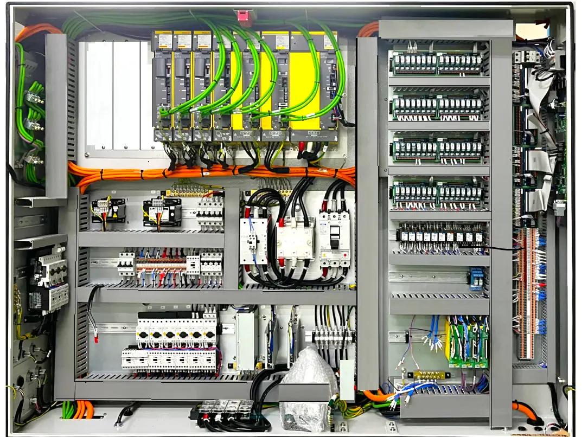
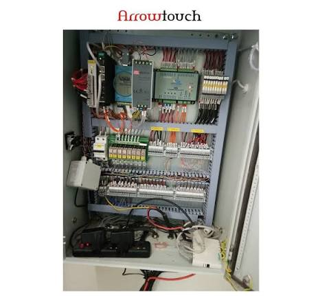
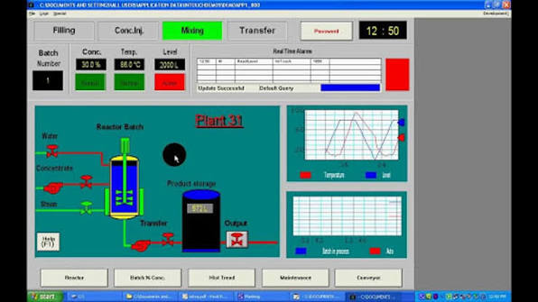
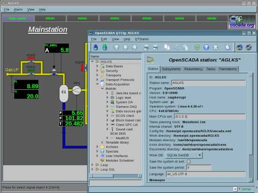
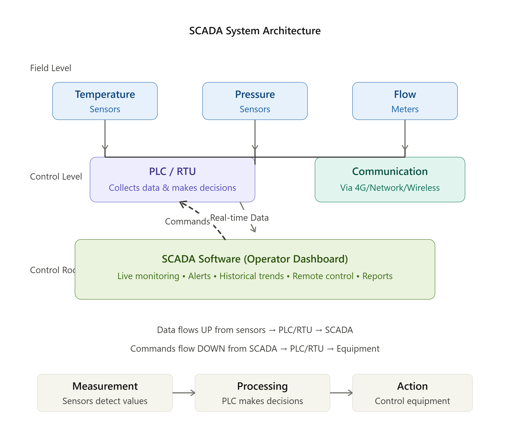

# 🏭 SCADA System: Complete Beginner's Guide

> Everything you need to know about SCADA, PLCs, and RTUs - from basics to career

---

## 📑 Table of Contents

1. [What is SCADA?](#what-is-scada)
2. [Why Do We Use SCADA?](#why-do-we-use-scada)
3. [Where is SCADA Used?](#where-is-scada-used)
4. [SCADA Applications](#scada-applications)
5. [How SCADA Works](#how-scada-works)
6. [PLC - Programmable Logic Controller](#plc---programmable-logic-controller)
7. [RTU - Remote Terminal Unit](#rtu---remote-terminal-unit)
8. [SCADA Software](#scada-software)
9. [All Together: How They Work](#all-together-how-they-work)
10. [Your Career in SCADA](#your-career-in-scada)

---

# PART 1: SCADA BASICS

---

## 🎯 What is SCADA?

### Simple Definition

**SCADA = Supervisory Control and Data Acquisition**

In plain English: **A system that lets you watch and control industrial stuff from far away.**

### Break It Down

```
SUPERVISORY  = Watching/observing from a distance
     ↓
CONTROL      = Being able to turn things on/off, adjust settings
     ↓
DATA         = Collecting information (temperature, pressure, etc.)
ACQUISITION  = Gathering that information automatically
```

### Real-Life Analogy

Imagine you're managing a **large apartment building** with:
- Water supply for all units
- Electricity for all apartments
- Heating/cooling system
- Security cameras

**Without SCADA:**
- ❌ You have to walk around physically checking everything
- ❌ You can't see if there's a leak until water damage happens
- ❌ Takes hours to turn off water if there's a problem
- ❌ Someone has to be there 24/7

**With SCADA:**
- ✅ See everything from your office on a computer screen
- ✅ Get instant alert if water pressure drops (leak detected!)
- ✅ Turn off the water valve from your computer in 10 seconds
- ✅ One person can manage everything, anytime, anywhere

---

## ❓ Why Do We Use SCADA?

### Problems Without SCADA

| Problem | Impact |
|---------|--------|
| Manual checks required | Need people everywhere 24/7 |
| Slow response | By the time you fix it, damage already done |
| Human error | People make mistakes when tired |
| No data history | Can't see patterns or problems |
| High labor cost | Hiring many workers = expensive |
| Downtime detection delay | Problems found hours/days later |

### Solutions SCADA Provides

| Solution | Benefit |
|----------|---------|
| Real-time monitoring | See everything instantly |
| Instant alerts | Know about problems immediately |
| Automatic responses | System fixes small problems itself |
| Historical data | Track trends over months/years |
| Remote control | Manage from office, not the field |
| Reduced human error | Consistent automated responses |
| Lower labor cost | 1-2 people can manage entire system |
| Quick problem detection | Issues caught in seconds, not hours |

### Cost Benefit Example: Power Plant

```
Without SCADA (Old Way):
├─ Workers visit each location daily
├─ Manual readings = slow
├─ Blackout discovered by customers complaining
├─ Cost to respond: ₹2 lakhs (workers' time)
└─ Total damage: ₹50 lakhs (city loses power for hours)

With SCADA (Smart Way):
├─ Automatic monitoring 24/7
├─ Problem detected in 30 seconds
├─ Operator fixes in 5 minutes
├─ Cost to respond: ₹2000 (just operator's computer work)
└─ Total damage: ₹0 (power restored before anyone notices)

SAVINGS: ₹50 lakhs per incident!
```

---

## 🌎 Where is SCADA Used?

1. Power Plants & Electricity Grid

Monitor voltage, current, generator performance
Detect power outages instantly
Reroute electricity to prevent blackouts
Example: A power plant in Mumbai monitors 50+ substations from one control room

2. Water Treatment & Supply

Monitor water quality (pH, chlorine levels)
Control pump speeds based on demand
Detect leaks in pipelines
Example: Delhi Water Board uses SCADA to manage water distribution across the city

3. Oil & Gas Industry

Monitor pipeline pressure and flow
Detect leaks instantly
Control refinery processes
Example: A refinement plant tracks 100+ parameters in real-time

4. Manufacturing Plants

Monitor assembly line speed, temperature, humidity
Control robotic arms, conveyor belts
Track production metrics
Example: A textile mill monitors 20+ looms simultaneously

5. Railways

Monitor train signals, track switches
Control traffic lights at crossings
Track train locations in real-time
Example: Indian Railways uses SCADA for metro systems

6. Smart Buildings

Control HVAC (heating/cooling), lighting
Monitor energy consumption
Security & access control
Example: An office building adjusts AC based on occupancy

## 💼 SCADA Applications Summary

```
INDUSTRY EXAMPLES:

POWER
├─ Power plants
├─ Electricity grid
└─ Substations

WATER
├─ Water treatment
├─ Water distribution
└─ Wastewater management

OIL & GAS
├─ Refineries
├─ Pipelines
└─ Drilling operations

MANUFACTURING
├─ Assembly lines
├─ Quality control
└─ Inventory management

TRANSPORT
├─ Railway systems
├─ Metro systems
└─ Traffic signals

BUILDINGS
├─ Office buildings
├─ Hospitals
└─ Shopping malls

ENERGY
├─ Solar farms
├─ Wind farms
└─ Hydroelectric dams
```

---

# PART 2: HOW SCADA WORKS

---

## 🔧 How SCADA System Works (Basic Architecture)

### Simple Flow

```
┌─────────────────┐       ┌──────────┐       ┌────────────────┐
│   SENSORS AT    │       │DEVICES   │       │  CONTROL ROOM  │
│  REMOTE SITES   │──────▶│ (PLCs/   │──────▶│  (SCADA        │
│                 │       │ RTUs)    │       │  SOFTWARE)     │
│ • Temperature   │       │          │       │                │
│ • Pressure      │       │ Make     │       │ • Dashboard    │
│ • Flow rate     │       │ decisions│       │ • Alerts       │
│ • Switches      │       │          │       │ • Reports      │
└─────────────────┘       └──────────┘       └────────────────┘
        │                        │                    │
        │                        │                    │
        └────────────────────────┴────────────────────┘
                Continuous Loop
```

### Step-by-Step Process

```
STEP 1: DATA COLLECTION
└─ Sensors measure things (temperature, pressure, flow)
└─ Sensors send data to PLC/RTU

STEP 2: PROCESSING
└─ PLC/RTU receives data
└─ Checks if values are normal
└─ Makes automatic decisions

STEP 3: ACTION
└─ PLC/RTU sends commands to equipment
└─ Motors turn on/off
└─ Valves open/close
└─ Pumps speed up/down

STEP 4: REPORTING
└─ PLC/RTU sends status to SCADA
└─ SCADA updates operator dashboard
└─ Operator sees everything in real-time

[REPEAT THIS LOOP CONTINUOUSLY]
```

---

## 📊 Example: Water Treatment Plant

Let me show you a real scenario:

### Equipment Setup

```
SENSORS (Things that measure):
├─ pH sensor (is water acidic/basic?)
├─ Chlorine sensor (enough disinfectant?)
├─ Flow meter (how fast water flowing?)
├─ Temperature sensor (water temperature?)
└─ Tank level sensor (how full is tank?)

ACTUATORS (Things that act):
├─ Chemical pump (add chlorine)
├─ Main pump (pump water)
├─ Valve (open/close water flow)
└─ Cooling system (reduce temperature)
```

### Real-Time Scenario

```
TIME 09:00:00
└─ Water flowing into treatment plant
└─ Chlorine level: 0.8 mg/L (✓ Normal)
└─ pH: 7.2 (✓ Normal)
└─ Temperature: 28°C (✓ Normal)
└─ Dashboard shows: All Green ✅

TIME 09:15:00
└─ New water batch arrives
└─ Chlorine level drops to 0.5 mg/L (⚠️ LOW!)
└─ PLC/RTU detects problem
└─ System automatically turns ON chemical pump
└─ More chlorine added to water

TIME 09:16:00
└─ Chlorine level back to 0.8 mg/L
└─ System turns OFF chemical pump
└─ SCADA dashboard shows: "Chlorine restored"
└─ No alert to operator (system fixed itself!)

TIME 09:30:00
└─ Temperature rises to 32°C (⚠️ WARM)
└─ System turns ON cooling fan
└─ Temperature drops back to 28°C
└─ All normal again

[WITHOUT SCADA, what would happen?]
❌ Worker visits plant at 11:00 AM
❌ Discovers water was chlorine-deficient for 2 hours
❌ All that water has to be thrown away
❌ Loss: ₹50,000+ of water + labor
❌ Environmental waste
```

---

# PART 3: THE HARDWARE

---

## 🤖 PLC - Programmable Logic Controller

### What is a PLC?

A **PLC is a specialized computer that sits at your factory/facility and automatically makes decisions based on sensor inputs.**

It's like a robot brain that:
- 👁️ Sees sensor data
- 🧠 Thinks (runs logic)
- ✋ Acts (controls equipment)
- 🔄 Repeats forever without stopping

### Simple Analogy

Think of a PLC like an **if-else robot**:

```
IF (Bottle_Arrives) {
    Turn_ON_Pump()
    Wait(2 seconds)
    Turn_OFF_Pump()
    Move_Conveyor()
}

IF (Pressure_Too_High) {
    Open_Pressure_Valve()
}

IF (Temperature_Too_High) {
    Turn_ON_Cooling_Fan()
}
```

The PLC runs these rules thousands of times per second, forever.

---

### Why Not Just Use a Regular Computer?

| Feature | PLC | Regular Computer |
|---------|-----|------------------|
| **Restarts/Updates** | Never needed | Windows updates needed |
| **Response Speed** | Milliseconds | Can be slow |
| **Factory Environment** | Handles dust, heat, vibration | Breaks down easily |
| **Direct Equipment Control** | Connected directly to motors/valves | Needs external devices |
| **Cost of Failure** | Very high (factory stops) | Not critical |

**Real Talk:** If a factory loses production for 1 hour due to system failure, the company loses ₹10-50 lakhs. A PLC must be rock solid.

---


### What's Inside a PLC?

```
┌───────────────────────────────┐
│    INSIDE A PLC               │
├───────────────────────────────┤
│                               │
│  INPUT MODULES                │
│  └─ Connect to sensors        │
│  └─ Read: temperature,        │
│     pressure, switches        │
│                               │
│  CPU (Processor)              │
│  └─ Runs your program         │
│  └─ Makes decisions           │
│  └─ Has memory                │
│                               │
│  OUTPUT MODULES               │
│  └─ Connect to motors/valves  │
│  └─ Control: pumps, lights    │
│                               │
│  COMMUNICATION MODULE          │
│  └─ Sends data to SCADA       │
│  └─ Receives commands         │
│                               │
└───────────────────────────────┘
```

---

### How a PLC Works (Scan Cycle)

A PLC does the same thing thousands of times per second:

```
1. READ INPUTS
   └─ Check all sensors
   
2. RUN LOGIC
   └─ Execute your program
   
3. WRITE OUTPUTS
   └─ Send commands to equipment
   
4. COMMUNICATE
   └─ Send status to SCADA
   
[REPEAT 1000 TIMES PER SECOND]
```

---

### Real Example: Bottling Machine

```
SETUP:
├─ Bottles coming on conveyor
├─ Sensor detects bottle position
├─ Pump fills water
├─ Conveyor moves to next station

PLC PROGRAM:
└─ IF bottle_detected:
   ├─ open_pump_valve()
   ├─ wait(2 seconds)
   ├─ close_pump_valve()
   ├─ move_conveyor()
   └─ IF anything_wrong:
      └─ stop_everything() + alert

RESULT:
└─ Perfect bottles filled automatically
└─ No human needed
└─ Works 24/7
```

---

## 📍 RTU - Remote Terminal Unit

### What is an RTU?

An **RTU is a device that collects data at remote/distant locations and sends reports back to the control center.**

**Main difference from PLC:** RTU is for **monitoring distant places**, while PLC is for **controlling on-site equipment**.

### When to Use RTU vs PLC

| Situation | Use |
|-----------|-----|
| Factory with equipment nearby | PLC |
| Power substation 20km away | RTU |
| Manufacturing on one floor | PLC |
| Multiple facilities in different cities | RTU for each |
| Quick local decisions needed | PLC |
| Regular reports from distance | RTU |

---

### Real Example: Monitoring Power Substations

**Scenario:** You manage **50 power substations** across a city, but you sit in the main office.

```
WITHOUT RTU (Old Way):
❌ Hire worker to visit each substation daily
❌ Write down readings in notebook
❌ Report back to office (takes hours)
❌ Can't respond to emergencies quickly
❌ Very expensive (₹20,000/day for workers)

WITH RTU (Smart Way):
✅ Small device (RTU) at each substation
✅ Automatically collects voltage, current, temperature
✅ Sends data via 4G to main office every 5 minutes
✅ Operator sees all 50 substations on one screen
✅ Instant alert if voltage abnormal
✅ Very cheap (₹2000/month for data)
```

---



### What's Inside an RTU?

```
┌─────────────────────────┐
│   RTU AT REMOTE SITE    │
├─────────────────────────┤
│                         │
│  SENSOR INPUTS          │
│  └─ Multiple sensors    │
│                         │
│  DATA STORAGE           │
│  └─ Save if offline     │
│                         │
│  COMMUNICATION ⭐       │
│  ├─ 4G Modem            │
│  ├─ Radio               │
│  └─ Satellite           │
│                         │
│  BATTERY BACKUP         │
│  └─ Keep running        │
│     if power lost       │
│                         │
│  PROCESSOR              │
│  └─ Simple logic        │
│  └─ Send data when      │
│     asked               │
│                         │
└─────────────────────────┘
```

---

### How RTU Communicates

RTUs use **standard communication protocols** so they can talk to any SCADA system:

**Modbus (Most Common):**
```
RTU sends to Control Room:
"Device_ID: 05, 
 Temperature: 42°C, 
 Pressure: 8.5 bar, 
 Time: 14:30:45"

Control Room receives and displays it.
```

---

## 🖥️ SCADA Software

### What is SCADA Software?

**SCADA software is the dashboard/application that operators use to see everything and control everything.**

Think of it as the **"command center"** where an operator sits and:
- 👁️ Sees all real-time data
- 📊 Watches historical trends
- 🔔 Gets alarms
- 🎮 Controls devices
- 📈 Generates reports

---

### What Does SCADA Software Show?

```
OPERATOR DASHBOARD:

┌─────────────────────────────────────────┐
│  WATER TREATMENT PLANT DASHBOARD        │
├─────────────────────────────────────────┤
│                                         │
│  REAL-TIME GAUGES:                      │
│  ├─ Temperature: 28°C        [████░░░░] │
│  ├─ pH: 7.2                  [██████░░] │
│  ├─ Chlorine: 0.8 mg/L       [███░░░░░] │
│  └─ Flow: 450 L/min          [████████░] │
│                                         │
│  ALARMS:                                │
│  🔴 Chlorine pump pressure low          │
│  🟡 Cooling system temperature high     │
│  🟢 All other systems normal            │
│                                         │
│  CONTROLS:                              │
│  [Increase Pump Speed] [Manual Override]│
│                                         │
│  TRENDS (Last 24 Hours):                │
│  Temperature: ╱╲___╱╲___ (varies)       │
│  pH: ───────── (stable)                 │
│  Chlorine: ╲╱───╲╱─── (varies)          │
│                                         │
│  Status: All systems running            │
│  Last Update: 14:32:10                  │
│                                         │
└─────────────────────────────────────────┘
```

---

### Popular SCADA Software

| Software | Company | Cost | Best For |
|----------|---------|------|----------|
| **Wonderware** | Invensys | ₹5-20L | Large operations |
| **FactoryTalk** | Rockwell | ₹10-50L | Manufacturing |
| **Ignition** | Inductive | ₹2-10L | Modern web-based |
| **OpenSCADA** | Open Source | FREE ✅ | Learning & startups |

---

## wonderware softeware



## openscada

### Key Features of SCADA Software

1. **Real-Time Monitoring** - See live data instantly
2. **Alerting** - Get notifications when problems occur
3. **Historical Data** - Store data for months/years
4. **Trending & Analysis** - View graphs and patterns
5. **Remote Control** - Send commands from office
6. **Reporting** - Generate daily/weekly/monthly reports
7. **User Management** - Different permission levels

---

# PART 4: HOW THEY ALL WORK TOGETHER

---

## 🔗 The Complete SCADA System

### All Three Components Together

```
┌──────────────────────────────┐
│   SENSOR DEVICES (FIELD)     │
│  ├─ Temperature sensors      │
│  ├─ Pressure gauges          │
│  ├─ Flow meters              │
│  └─ Motors, pumps, valves    │
└────────────┬─────────────────┘
             │
             ▼
┌──────────────────────────────┐
│  PLC / RTU (CONTROL UNIT)    │
│  ├─ Collects sensor data     │
│  ├─ Makes local decisions    │
│  ├─ Controls equipment       │
│  └─ Sends status to SCADA    │
└────────────┬─────────────────┘
             │
             ▼
┌──────────────────────────────┐
│   SCADA SOFTWARE (OFFICE)    │
│  ├─ Shows live data          │
│  ├─ Stores history           │
│  ├─ Sends alerts             │
│  ├─ Lets operator control    │
│  └─ Generates reports        │
└──────────────────────────────┘
```

---



### Real Example: Water Pipeline System

**Scenario:** Managing 2 water pumping stations 10km apart.

```
PUMPING STATION 1 (10km away):
├─ Water pump
├─ Pressure sensor
├─ Flow meter
└─ RTU device (with 4G modem)

PUMPING STATION 2 (15km away):
├─ Water pump
├─ Pressure sensor
├─ Flow meter
└─ RTU device (with 4G modem)

───────────────────────────────────

What Happens:

09:00:00 - Both stations pump water normally
└─ Flow: Station1=500 L/min, Station2=480 L/min
└─ RTUs send data to control room

09:05:00 - RTU1 detects pressure drop (leak!)
└─ Sends: "Station1: Pressure dropping, possible leak"
└─ SCADA receives alert
└─ Operator sees: 🔴 ALERT at Station1

09:06:00 - Operator decides to reduce Station1 flow
└─ Sends command: "Station1: Reduce to 50%"
└─ RTU1 receives command
└─ RTU1 adjusts pump speed down

09:06:30 - Leak pressure stabilized
└─ New flow: Station1=250 L/min
└─ Station2 now: 600 L/min (increased to compensate)
└─ City still gets water (980 L/min total)
└─ No emergency, service continues

09:30:00 - Field technician arrives
└─ Fixes the leak
└─ Station1 restored to full speed

[ENTIRE EVENT HANDLED IN 30 MINUTES, ONE PERSON, NO CRISIS]
```

---

## 🔄 Data Flow Cycle

### Complete Journey of One Measurement

```
STEP 1: MEASUREMENT
└─ Sensor detects something
   (e.g., Temperature = 45°C)

STEP 2: TRANSMISSION TO PLC/RTU
└─ Sensor sends signal to PLC/RTU
   (takes milliseconds)

STEP 3: PLC/RTU PROCESSING
└─ Checks: Is 45°C normal?
   └─ If YES: Do nothing
   └─ If NO: Take action

STEP 4: EQUIPMENT CONTROL
└─ If too hot:
   └─ Turn on cooling fan
   └─ Reduce heating
   
STEP 5: SCADA UPDATE
└─ PLC/RTU sends: "Temp=45°C, Fan=ON"
└─ Via network (WiFi/4G/cable)

STEP 6: OPERATOR SEES IT
└─ Dashboard updates: "Temperature: 45°C 🔴"
└─ Operator notified

STEP 7: HISTORY STORED
└─ Database saves: "2024-06-17 09:30:00 → Temp=45°C"
└─ Useful for trend analysis

[ENTIRE CYCLE TAKES 1-2 SECONDS]
```

---

# PART 5: YOUR CAREER

---

## 💼 Why This Matters for You

As a **CS diploma student with full-stack coding experience**, SCADA/Industrial automation is a **high-paying, high-demand career path** you should know about.

### Why It's Perfect for You

**Your Skills Already Apply:**
- ✅ React → Build SCADA dashboards
- ✅ Node.js → Connect to PLCs/RTUs
- ✅ MongoDB → Store sensor data
- ✅ JavaScript → Real-time data handling
- ✅ APIs → Connect systems together
- ✅ WebSockets → Live data updates

**Industries Are Desperate for Your Skills:**
- Power companies upgrading to smart systems
- Water authorities modernizing infrastructure
- Manufacturing going Industry 4.0
- Oil & gas safety improvements
- Building automation growing

---

<!-- ## 🚀 How to Get There (Action Plan)

### Step 1: Build a Portfolio Project (MUST DO!)

**Build a Mini SCADA Dashboard:**

```
TIMELINE: 2-3 weeks

WHAT TO BUILD:
├─ React Dashboard showing:
│  ├─ Real-time temperature gauge
│  ├─ Pressure line chart
│  ├─ Historical trends (24-hour graph)
│  ├─ Alarm notifications
│  └─ Manual control buttons
│
├─ Node.js Backend with:
│  ├─ Connection to Modbus simulator
│  ├─ Collect sensor data every 5 seconds
│  ├─ Store in MongoDB
│  ├─ REST APIs for frontend
│  └─ WebSocket for real-time updates
│
└─ Features:
   ├─ If temp > 50°C → Show red alert
   ├─ If temp < 10°C → Show blue alert
   ├─ View last 24 hours of data
   ├─ Manually set temperature target
   └─ Save/export reports

RESULT:
└─ GitHub project showing industrial monitoring system
└─ Impressive for interviews
└─ Shows you understand SCADA concepts
└─ Directly relevant to real jobs
```

---

### Step 2: Learn the Protocols

**Essential Knowledge:**
1. **Modbus** (most important, easiest)
   - How devices communicate
   - How to read/write data
   - Free online tutorials

2. **Time-Series Data**
   - How to store sensor readings
   - Timestamps for every measurement
   - Tools: InfluxDB, TimescaleDB

3. **Industrial Concepts**
   - PLC scan cycle
   - Sensor ranges
   - Safety requirements

**Time Required:** 1-2 weeks

---

### Step 3: Polish Your Resume

**Don't Say:** "Built React + Node.js projects"

**Say:** "Developed a real-time SCADA monitoring dashboard in React + Node.js with WebSocket integration, connected to Modbus RTU devices, featuring automated alarms and 24-hour trending - directly applicable to industrial automation and IoT systems used in power plants and water treatment facilities"

**Portfolio Showcase:**
```
Project: Mini SCADA Monitoring System
- Tech: React, Node.js, MongoDB, WebSocket, Modbus
- Features: Real-time gauges, alerts, historical trends
- Impact: Demonstrates understanding of industrial systems
- GitHub: [link to your project]
```

---

### Step 4: Apply for Jobs

**Job Boards:**
- LinkedIn (search: "SCADA Developer", "IoT Engineer")
- Naukri.com (search: "industrial automation")
- Internshala
- CutShort

**Companies to Target:**
- Siemens (huge in automation)
- Schneider Electric
- Bosch
- Rockwell Automation
- Ignition partners
- Consulting firms (TCS, Accenture for SCADA projects)

--- -->

## 📝 Interview Questions You'll Get

### Q1: What is SCADA?

**Answer:**
> "SCADA is a system that monitors and controls industrial processes remotely. It consists of sensors collecting data, PLCs/RTUs processing that data and making decisions, and SCADA software showing operators everything and letting them control from a central location."

---

### Q2: What's the difference between PLC and RTU?

**Answer:**
> "A PLC controls on-site equipment directly and makes fast decisions. An RTU is deployed at remote locations, collects data, and sends reports back. PLCs focus on control speed, RTUs focus on communication with the control center."

---

### Q3: Why not use a regular computer instead of a PLC?

**Answer:**
> "PLCs are hardened for industrial environments. They work 24/7 without reboots, respond in milliseconds, and handle extreme temperatures and vibrations. A regular computer would fail in a factory. Plus, downtime costs are massive—a factory losing ₹20 lakhs/hour can't afford Windows updates."

---

### Q4: How would you build a SCADA system for a power plant?

**Answer:**
> "I'd set up:
> - PLCs at generators controlling output and protecting equipment
> - RTUs at 50+ substations sending data via 4G
> - SCADA software in control room monitoring everything
> - Real-time alerts if voltage/frequency abnormal
> - Historical data for trend analysis
> - Operator can reroute power if needed
> - Redundant systems for 99.99% uptime
> - Security measures to prevent hacking"

---


## 📚 Quick Reference

### Key Terms

| Term | What It Is | Example |
|------|-----------|---------|
| **SCADA** | Monitoring & control system | Power grid management |
| **PLC** | On-site controller | Bottling machine control |
| **RTU** | Remote data collector | Substation monitoring |
| **Sensor** | Measures something | Temperature gauge |
| **Actuator** | Does something | Motor or pump |
| **HMI** | Operator dashboard | SCADA software screen |
| **Modbus** | Communication protocol | How devices talk |
| **Alert** | Problem notification | "Temperature too high!" |

---

### Three Components Compared

| Aspect | PLC | RTU | SCADA Software |
|--------|-----|-----|----------------|
| **Location** | Factory floor | 10-100km away | Office |
| **Main Job** | Control equipment | Collect data | Monitor & control |
| **Speed** | Milliseconds | Seconds/minutes | Real-time |
| **Cost** | ₹50K-₹5L | ₹20K-₹2L | ₹2L-₹50L |
| **Connection** | Hardwired | Wireless (4G) | Network |
| **Uptime Need** | 10+ years | 10+ years | 99.99% |

---

### Real-World Impact Example

**Before SCADA:**
```
Water treatment operator spends all day:
├─ Visiting 5 locations
├─ Reading gauges manually
├─ Writing down numbers
├─ Traveling between sites
└─ Problem discovered hours later
```

**With SCADA:**
```
One operator in office:
├─ Sees all 5 locations on screen
├─ Real-time data updated every second
├─ Automatic alerts when problems occur
├─ Can control from computer
└─ Problems fixed in minutes
```

**Result:**
- 4 fewer workers needed
- ₹20L/year salary savings
- Better response time
- Zero wasted water

---

---

## 💡 Final Words

**Remember:**
- SCADA is not rocket science - it's just automation
- Your full-stack skills are perfect for this industry
- Most diploma students don't know SCADA (you now have advantage!)
- High-paying jobs waiting for you
- Build the portfolio project and you're competitive

**You've got this!** 🚀

---

**Made for Group Presentation | Ready to Explain? Yes! 💪**

---

*Time to Read: 1-2 hours | Difficulty: Beginner-Friendly | Practical Value: Very High*