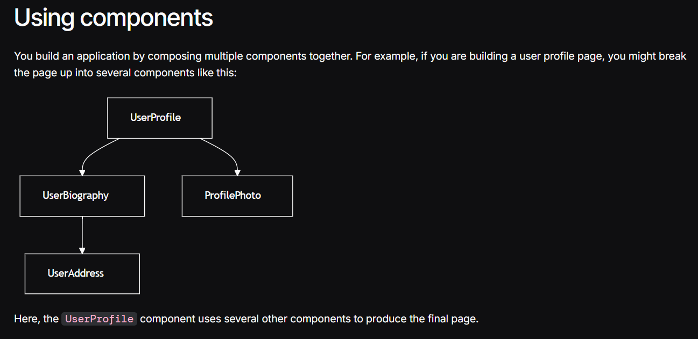

## What is Angular?
## Angular is a web framework that empowers developers to build fast, reliable applications.
* Maintained by a dedicated team at Google, Angular provides a broad suite of tools, APIs, and libraries to simplify and streamline your development workflow. Angular gives you a solid platform on which to build fast, reliable applications that scale with both the size of your team and the size of your codebase.

## steps to  install angular
1.npm install -g @angular/cli

## steps to Create a new project
1.ng new <project-name>
it will creates the project with the name

## to run the project
1.cd my-first-angular-app
2.npm start

## Components
The fundamental building block for creating applications in Angular
# Components are the main building blocks of Angular applications. Each component represents a part of a larger web page. Organizing an application into components helps provide structure to your project, clearly separating code into specific parts that are easy to maintain and grow over time.

## define a component

// user-profile.ts
@Component({
  selector: 'user-profile',
  templateUrl: 'user-profile.html',
  styleUrl: 'user-profile.css',
})
export class UserProfile {
  // Component behavior is defined in here
}

// user-profile.ts
import {ProfilePhoto} from 'profile-photo.ts';
@Component({
  selector: 'user-profile',
  imports: [ProfilePhoto],
  template: `
    <h1>User profile</h1>
    <profile-photo />
    
This is the user profile page

  `,
})
export class UserProfile {
  // Component behavior is defined in here
}