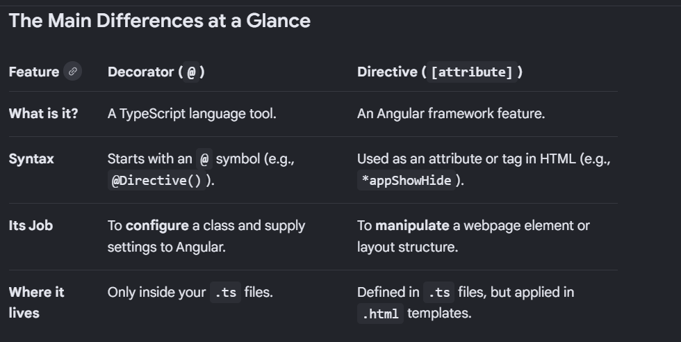

```
 decorator and a directive are two completely different concepts in Angular.
 The easiest way to understand the difference is: A decorator is a JavaScript tool used to configure a class, while a directive is an Angular feature used to manipulate an HTML element.
 
 Here is the breakdown of what each one does and how they differ:What is a Decorator? 
 (The Configurator)A decorator is like a metadata tag or an instruction manual for TypeScript. It always starts with an @ symbol (like @Component, @Directive, @Input, @HostListener).Decorators don't actually do anything on the webpage. Instead, they tell Angular exactly what a class or variable is supposed to be.Example analogy: Imagine you write a plain text file. A decorator is like putting a sticky note on top that says, "Treat this file as a kitchen recipe." Without the sticky note, it’s just random text.In code: When you write @Directive({ selector: '[appColor]' }) class MyClass {}, the @Directive part is the decorator. It tells Angular: "Hey, treat this normal TypeScript class as an HTML modifier!"
 
 What is a Directive? (The Element Modifier)A directive is a functional concept in Angular that alters the appearance, behavior, or structure of a DOM element in your HTML template.A directive is the entire package—it includes the TypeScript class, the injected tools (ElementRef, ViewContainerRef), and the logical code inside it that physically changes your webpage.Example analogy: The directive is the actual security guard or the paintbrush that modifies the room.In HTML: When you type <p appChangeText="blue">, you are actively using a directive to paint that paragraph blue.
 

 
 Summary Rule of ThumbYou use a decorator (@Directive) to tell Angular you want to create a directive.You use the directive in your HTML template to change your UI

```
